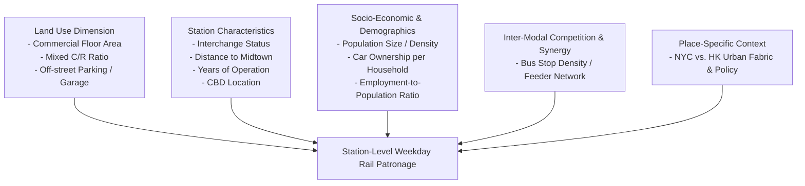

# Rail-based transit-oriented development: Lessons from New York City and Hong Kong

> [!summary] One-Sentence Summary
> This study evaluates factors influencing average weekday heavy rail ridership across station catchment areas in New York City and Hong Kong using multiple linear regression, demonstrating that station characteristics, commercial/mixed land use density, network connectivity, feeder bus integration, and car ownership jointly determine transit patronage across different metropolitan contexts (PDF pp. 202, 211).

## 1. Basic Information

| Field | Content |
|---|---|
| Authors | Becky P.Y. Loo, Cynthia Chen, Eric T.H. Chan |
| Year | 2010 |
| Publication | *Landscape and Urban Planning*, Vol. 97, No. 3, pp. 202–212 |
| DOI | 10.1016/j.landurbplan.2010.06.002 |
| Research Domain | [[Transit-Oriented Development]], [[Urban Transportation Planning]], [[Land Use and Transport Integration]] |
| Research Type | Empirical Research / Case Study |
| Research Object | Heavy rail stations and station-level weekday patronage |
| Study Area | New York City (USA) and Hong Kong (China) |
| Spatial Scale | [[Station Catchment Area]] (500m buffer / street block level), [[Metropolitan Scale]] |
| Temporal Scope | 2005 (average weekday patronage and demographic/built environment data) |

## 2. Research Background and Questions

### 2.1 Research Background
Transit-Oriented Development (TOD) has gained global traction as a key policy mechanism to curb automobile dependency and promote sustainable urban mobility (PDF p. 202). While extensive TOD research has examined suburban neighborhoods or newly developed greenfield sites where urban development and rail networks developed in tandem, far less attention has been directed toward mature, high-density metropolitan cities with pre-existing heavy rail infrastructure (PDF pp. 202–203). Large global cities like New York City (NYC) and Hong Kong (HK) possess heavily used rapid transit networks embedded within polycentric, highly developed urban fabrics. Understanding station-level factors driving patronage in these dense environments is vital for optimizing land use and transportation policies (PDF pp. 202–203).

### 2.2 Literature Gap
The authors identify three primary gaps in existing TOD literature:
1. **Methodological/Comparative Gap**: Most TOD studies rely on descriptive summaries of single sites or hypothetical simulation models, lacking cross-national multivariate statistical comparisons between North American metropolitan cities and high-density Asian/European hubs (PDF p. 204).
2. **Spatial Aggregation Gap**: Previous empirical studies primarily utilize coarse aggregate data at zonal, census tract, or city levels, or disaggregate household/individual surveys, missing the street-block catchment area scale immediately surrounding transit stations where physical land use directly interacts with transit access (PDF p. 204).
3. **Station-Level Patronage Modelling**: Limited research conducts city-wide, station-by-station empirical evaluations of ridership determinants covering full metro systems in major global cities exceeding 5 million residents (PDF pp. 202–204).

### 2.3 Research Objectives and Questions
- **Research Objectives**: To analyze and quantify the key factors across four dimensions—(i) land use, (ii) station characteristics, (iii) socio-economic/demographic attributes, and (iv) inter-modal competition—that account for station-level weekday rail ridership variability in NYC and HK, and to synthesize transferable lessons for sustainable urban planning (PDF pp. 202, 205).
- **Research Questions**: 
  1. What spatial, land use, demographic, and operational factors significantly drive weekday station patronage in large metropolitan rail networks?
  2. How do ridership determinants differ between a Western, auto-centric metropolis (NYC) and an ultra-dense, transit-dominant Asian metropolis (HK)?
  3. Are there common multi-dimensional factors that hold true across structurally different global metro systems?
- **Hypotheses or Propositions**: The authors do not explicitly formulate formal statistical hypotheses, but propose an analytical framework positing that station patronage is a multi-dimensional function of land use density/mix, network centrality, demographics, and modal integration (PDF pp. 203, 205).

## 3. Theoretical and Conceptual Framework

### 3.1 Core Concepts

| Concept | Definition or Usage in Paper | Operationalization | Obsidian Link |
|---|---|---|---|
| Transit-Oriented Development (TOD) | High-density, compact, mixed-use urban form around high-quality mass transit with pedestrian-friendly environments (PDF p. 202). | Categorized into land use, station features, and modal connectivity indicators within a 500m station buffer. | [[Transit-Oriented Development]] |
| Rail Transit Ridership | Average weekday passenger boardings/entries at individual heavy rail stations (PDF p. 205). | Station-level average weekday patronage entry data in 2005. | [[Rail Transit Ridership]] |
| Catchment Area | The spatial buffer zone surrounding a rail station influencing passenger walk-in and feeder access (PDF p. 204). | 500m buffer zone or street-block level catchment around each station. | [[Station Catchment Area]] |
| Mixed Land Use | Co-existence of residential, commercial, and civic land uses around stations driving bi-directional trip generation (PDF pp. 202, 207). | Binary dummy variable (`MIXED`) or composite commercial/residential floor area (`C/R`). | [[Mixed Land Use]] |
| Inter-Modal Competition & Synergy | Interplay between rail, bus feeder networks, and private automobiles in capturing travel demand (PDF pp. 207–209). | Number of bus stops within buffer (`BUS`), garage floor area (`GAR`), and off-street parking floor area (`PARK`). | [[Inter-Modal Competition]] |
| Self-Selection | Potential endogeneity where individuals preferring transit choose to reside near transit stations (PDF p. 203). | Qualitative literature discussion; noted as a background conceptual issue not directly controlled in station-level OLS. | [[Self-Selection]] |

### 3.2 Theoretical Foundations
The study grounds its conceptual structure in land use-transportation interaction literature, building upon early density-transit work by Newman and Kenworthy (1989), the New Urbanism movement, and Cervero and Kockelman's (1997) "3Ds" framework (Density, Diversity, Design) (PDF p. 203). It also builds on Cervero and Murakami's (2008) work on Hong Kong's "Rail plus Property" (R+P) mechanism and Kuby et al.'s (2004) station boardings model for light rail in the United States (PDF pp. 203–204, 210).

### 3.3 Conceptual Relationships
The analytical framework structures station patronage as an outcome determined by four intersecting urban dimensions:

## 4. Data and Methodology

### 4.1 Research Design
The paper adopts a quantitative, comparative cross-sectional research design employing Ordinary Least Squares (OLS) Multiple Linear Regression. Models are estimated separately for New York City ($n=406$), Hong Kong ($n=79$), and as a pooled, weighted combined dataset ($n=485$) (PDF pp. 205–207, 210).

### 4.2 Data

| Data / Sample | Source | Quantity & Time | Spatial Granularity | Usage | Limitations |
|---|---|---|---|---|---|
| Station Patronage Data (HK) | MTRC & KCRC (merged Dec 2007) (PDF p. 204) | 79 stations (out of 80), 2005 average weekday entries | Station level | Dependent variable in HK & combined models | Breakdown by hour, month, or day-of-week unavailable (PDF p. 205). |
| Station Patronage Data (NYC) | NYMTA MetroCard data (PDF p. 205) | 406 stations (out of 468), 2005 average weekday entries | Station level | Dependent variable in NYC & combined models | Temporal breakdowns unavailable; missing data in some stations (PDF p. 205). |
| Land Use & Floor Area Data | Planning / Building departments in NYC & HK | 2005 (or closest accessible year) | Street block / 500m buffer | Independent land use variables (`COM`, `C/R`, `PARK`, `GAR`) | Restricted by differing municipal land use recording systems (PDF p. 205). |
| Socio-demographic & Census Data | US Census (ACS 2005), HK Census & TCS (PDF pp. 203, 212) | 2005 Census / Travel Characteristics Survey | Catchment area block level | Demographic variables (`POP S`, `POP D`, `CARS`, `EMPOVERPOP`) | Variable definitions vary slightly between NYC and HK (PDF p. 205). |

### 4.3 Methodological Workflow
1. **Data Collection & GIS Buffer Generation**: Extracted station-level weekday patronage entries for 2005 and generated 500m spatial buffer catchment zones around rail stations in NYC and HK (PDF pp. 204–205).
2. **Variable Construction**: Calculated metrics across land use, station features, socio-demographics, and transit accessibility within catchment zones (PDF p. 206 Table 1).
3. **Individual Model Specification & Diagnostic Testing**: Estimated separate OLS regression models for NYC ($n=406$) and HK ($n=79$). Conducted collinearity diagnostics using Condition Index (threshold < 30), Variance Inflation Factor (VIF < 10), Tolerance (> 0.10), and Variance Proportions (PDF pp. 205–206).
4. **Data Harmonization & Weighting for Combined Model**: Standardized units to metric scale, transformed dummy variables (e.g., small garage dummy `GAR DUM`), introduced a city dummy variable (`NYC DUM`), and applied sample weighting based on observation ratios ($79 / 406$) to prevent NYC from overwhelming HK in pooled estimation (PDF p. 206).
5. **Combined OLS Regression & Model Comparison**: Estimated the pooled model ($n=485$, weighted) and evaluated explanatory power ($R^2$), beta coefficients, and dimension relative importance (PDF pp. 209–210).

### 4.4 Models, Indicators, and Variables

| Name | Type | Definition / Calculation | Role in Study |
|---|---|---|---|
| Weekday Patronage Entry | Dependent Variable | Average daily weekday passenger entries at a station in 2005 | Target metric to be explained |
| `COM` / `C/R` | Explanatory Variable (Land Use) | Total commercial floor area ($m^2$) or mixed commercial/residential floor area ($m^2$) | Measures non-residential & mixed employment activity |
| `GAR DUM` | Explanatory Variable (Land Use) | Dummy variable: 1 if garage floor area < 90th percentile ($< 53,202 m^2$ in NYC), 0 otherwise | Captures garage constraint / bottleneck effects |
| `PARK` | Explanatory Variable (Land Use) | Total off-street parking floor area ($m^2$) | Measures structured parking supply around stations |
| `MIXED` | Explanatory Variable (Land Use) | Dummy variable: 1 if mixed land uses co-exist within buffer, 0 otherwise | Captures land use functional diversity |
| `INTER` | Explanatory Variable (Station) | Dummy variable: 1 if major interchange station, 0 otherwise | Measures rail network centrality & transfer capacity |
| `DIST MID` | Explanatory Variable (Station) | Generalized travel cost from station to Midtown in USD | Measures spatial peripherality relative to commercial core |
| `YRS OP` | Explanatory Variable (Station) | Years of station operation since opening | Measures historical maturity & urban embedding |
| `CBD DUM` | Explanatory Variable (Station) | Dummy variable: 1 if located in Central Business District, 0 otherwise | Captures core urban centrality |
| `POPS` / `POP D` | Explanatory Variable (Demographic) | Total population size or population density per residential floor area ($m^2$) | Measures residential catchment baseline |
| `CARS` | Explanatory Variable (Demographic) | Average household car ownership per household | Captures vehicle availability / access behavior |
| `EMPOVERPOP` | Explanatory Variable (Demographic) | Ratio of employment size to population size in catchment | Captures employment dominance vs. balance |
| `BUS` | Explanatory Variable (Inter-modal) | Number of bus stops within 500m station buffer | Measures multimodal bus feeder connection density |
| `NYC DUM` | Explanatory Variable (City Context) | Dummy variable: 1 if station is in NYC, 0 if in HK | Captures baseline structural differences between cities |

#### Mathematical Model Specification
The multiple linear regression model is formally expressed as:

$$	ext{Patronage}_i =  eta_0 + \sum_{k=1}^{K}  eta_k X_{k,i} +  arepsilon_i$$

Where:
- $	ext{Patronage}_i$: Average weekday passenger entry at rail station $i$.
- $ eta_0$: Constant intercept.
- $ eta_k$: Estimated partial regression coefficient for explanatory variable $X_{k,i}$.
- $X_{k,i}$: Value of the $k$-th independent variable (across land use, station characteristics, socio-demographics, and inter-modal competition) for station $i$.
- $ arepsilon_i$: Unobserved stochastic error term, assumed $ arepsilon_i \sim N(0, \sigma^2)$.

### 4.5 Methodological Evaluation
- **Methodological Reasonableness**: Using OLS regression at the station catchment level is appropriate for quantifying the aggregate effects of urban built environment variables on patronage (PDF p. 203).
- **Improvements over Prior Studies**: Standardizes street-block level spatial metrics across two global mega-cities, incorporating multi-dimensional variables (parking, station age, travel costs) missing in earlier aggregate literature (PDF p. 205).
- **Potential Biases & Validity Risks** *(Analytical Synthesis)*:
  1. *Spatial Autocorrelation*: While spatial variables (`DIST MID`, `CBD DUM`, railway line dummies) were included to capture location effects, spatial lag/error models (e.g., Spatial Autoregressive models) were not formally estimated to test residual spatial dependence.
  2. *Cross-Sectional Endogeneity*: The model cannot resolve causality or residential self-selection bias due to the cross-sectional design.
  3. *Modifiable Areal Unit Problem (MAUP)*: Fixing catchment zones strictly at 500m buffers may misestimate effective pedestrian sheds in hyper-dense multi-level station networks like Hong Kong.
- **Reproducibility Information Deficits**: Exact GIS spatial joining rules for street-block boundaries to 500m buffers, exact formulas for calculating "generalized travel cost to Midtown in USD," and detailed data transformation code are not fully published in the text.

## 5. Main Findings

### 5.1 Core Findings

1. **Dominance of Station Characteristics Dimension**: In all three regression models, station characteristics variables exhibited the highest statistical significance and standardized beta coefficients (PDF pp. 207, 211). In NYC, `INTER` had the highest beta ($ eta = 0.60, t = 21.99$); in HK, `YRS OP` was the strongest predictor ($ eta = 0.42, t = 5.65$); in the combined model, `YRS OP` ($ eta = 0.49, t = 10.05$), `CBD DUM` ($ eta = 0.18, t = 8.08$), and `INTER` ($ eta = 0.16, t = 6.40$) drove patronage (PDF pp. 207, 210 Tables 2 & 3). Authors note network connectivity and historical maturity are paramount for patronage.
2. **Positive Association Between Car Ownership and Rail Patronage**: Average household car ownership (`CARS`) was statistically significant and *positively* associated with weekday rail patronage across all three models: NYC ($B = 28,070.24, p = 0.00$), HK ($B = 60,238.57, p = 0.01$), and Combined ($B = 36,668.48, p = 0.00$) (PDF pp. 207, 210). Authors explain that higher car ownership reflects higher overall trip generation rates and indicates car use for short pick-up/drop-off and park-and-ride legs connecting to long rail trips (PDF pp. 207–208, 211).
3. **Synergy Between Bus Feeder Networks and Rail Ridership**: The number of bus stops within the catchment (`BUS`) was positively associated with rail patronage in HK ($B = 860.67, t = 3.98, p = 0.00$) and the Combined model ($B = 410.76, t = 6.05, p = 0.00$) (PDF pp. 207, 210). Contrary to the view that buses merely compete with rail, inter-modal coordination in dense cities allows bus routes to act as essential feeder links that boost rail station entry (PDF p. 209).
4. **Commercial and Mixed Land Use Drive Patronage**: Commercial floor area (`COM`) and mixed commercial/residential development (`C/R`, `MIXED`) significantly increase station patronage (PDF pp. 207, 210). In HK, $10,000 m^2$ of additional $C/R$ floor area yields ~100 additional weekday entries ($B = 0.01, p = 0.00$), while mixed land use (`MIXED`) adds ~10,629 daily entries ($p = 0.03$) by generating bi-directional, all-day travel demand (PDF p. 207).
5. **Employment-to-Population Imbalance Penalizes Patronage in High-Density Contexts**: In the Hong Kong model, employment relative to population (`EMPOVERPOP`) was the *only* variable with a negative regression coefficient ($B = -3702.71, t = -2.72, p = 0.01$) (PDF p. 207). This indicates that pure, mono-functional employment hubs lacking integrated residential density generate lower overall daily station patronage compared to balanced mixed-use nodes (PDF p. 209).
6. **Significant Place-Specific Contextual Differences**: In the combined model, the New York City dummy variable (`NYC DUM`) was highly significant with a massive negative coefficient ($B = -51,439.33, t = -16.02, p = 0.00$) (PDF p. 210 Table 3). After controlling for density, land use, and station attributes, NYC stations systematically generate far lower average weekday entries than HK stations (mean entry 12,174 vs. 43,888), highlighting the profound impact of HK's transit-dominant, compact urban fabric (PDF pp. 206, 209–210).

### 5.2 Secondary Findings and Anomalies
- **Parking and Garage Constraints**: In NYC, a small garage floor area dummy (`GAR DUM` < 90th percentile) was significantly negative ($B = -6160.87, p = 0.00$), showing that severe garage shortages act as localized bottlenecks, whereas in HK, structured off-street parking (`PARK`) was positively correlated with patronage ($B = 0.08, p = 0.00$) due to large composite podium mall developments built directly above rail stations (PDF p. 207).
- **Distance to Midtown**: Generalized travel cost to Midtown (`DIST MID`) had a negative coefficient in NYC ($B = -715.42, p = 0.00$) and Combined ($B = -600.75, p = 0.00$), confirming that peripheral stations located farther from major commercial centers experience lower transit competitiveness against private cars (PDF pp. 207, 210).

### 5.3 Mapping Findings to Research Questions

| Research Question / Topic | Corresponding Finding | Supported? | Evidence Location |
|---|---|---|---|
| Q1: Multi-dimensional drivers of rail ridership | Station features, commercial density, population size, bus stops, and car ownership jointly drive ridership ($R^2 = 0.59 	ext{ to } 0.74$). | Supported | PDF pp. 207, 210 (Tables 2 & 3) |
| Q2: Divergence between Western (NYC) and Asian (HK) models | HK relies more on mixed C/R density, bus feeders, and station age, while NYC relies heavily on interchange status and population size. `NYC DUM` coefficient is $-51,439.33$. | Supported | PDF pp. 206–210 |
| Q3: Common cross-city ridership principles | Interchange status (`INTER`), commercial floor area (`COM`), car ownership (`CARS`), and station maturity (`YRS OP`) are common drivers across both cities. | Supported | PDF pp. 209–211 (Table 3) |

## 6. Discussion and Contributions

### 6.1 Theoretical Contribution
Extends the land use-transportation interaction literature (e.g., Cervero's 3Ds) into mature, mega-city contexts. It proves that within high-density metropolitan systems, **Station Characteristics** (network topology, transfer capacity, historical centrality) exert a stronger influence on station patronage than land use density alone (PDF pp. 207, 211).

### 6.2 Methodological Contribution
Demonstrates a standardized, multi-city comparative regression framework operating at the fine-grained **Station Catchment Area (500m street-block level)**, combining land use floor area, network travel costs, demographic census data, and transit operational metrics while resolving cross-city sample size imbalances through data weighting (PDF pp. 205–206, 209–210).

### 6.3 Empirical Contribution
Provides empirical station-level patronage baseline metrics for two of the world's busiest heavy rail systems (NYC Subway and HK MTR/KCR), revealing counter-intuitive findings such as the positive association between household car ownership and rail ridership, and the complementary relationship between bus stops and rail patronage (PDF pp. 207–209).

### 6.4 Practical and Policy Implications
- **Prioritize Station Connectivity & Upgrades**: Transit authorities should invest in interchange infrastructure, transfer seamlessly between lines, and optimize station access environment, as station attributes provide the highest leverage for patronage (PDF p. 211).
- **Promote Mixed-Use Podium Development**: Land use zoning should encourage mixed commercial-residential floor area (`C/R`) around stations to generate balanced, bi-directional travel flows throughout the day (PDF pp. 207, 211).
- **Enhance Bus Feeder Integration**: Transit agencies should avoid removing bus stops near rail stations under competitive assumptions, and instead design coordinated feeder bus networks to expand rail catchment sheds (PDF p. 209).

## 7. Limitations and Future Research

### 7.1 Limitations Explicitly Acknowledged by Authors
1. **Restricted Variable Set**: Independent variables were constrained by limited data availability at the street-block level and differing statistical collection methods between NYC and HK (PDF p. 205).
2. **Small Sample Size for Hong Kong**: The HK station dataset was relatively small ($n = 79$), restricting the number of explanatory variables that could be simultaneously estimated in OLS regression without loss of statistical power (PDF p. 205).
3. **Temporal Data Aggregation**: Patronage data consisted of annual weekday averages without temporal granularity by time of day (peak vs. off-peak), day of week, or monthly variation (PDF p. 205).
4. **Commercial Sensitivity**: Detailed station-by-station patronage breakdowns are commercially sensitive and difficult to obtain across global transit systems (PDF p. 211).

### 7.2 Further Identified Limitations *(Analytical Synthesis)*
1. **Absence of Environmental & Topographical Variables**: The study focuses purely on urban built environment metrics (floor area, parking, bus stops) and omits natural landscape constraints, water bodies, microclimate, or ecological boundaries—making direct application to eco-sensitive areas unaddressed.
2. **Omission of Pedestrian Network Micro-Design**: A 500m Euclidean or street-block buffer does not account for 3D multi-level footbridge networks, continuous air-conditioned walkways, or severe terrain barriers that heavily dictate actual walking catchment sheds in Hong Kong.
3. **Potential Unobserved Spatial Dependence**: Lack of formal spatial econometric diagnostics (e.g., Moran's I on residuals, Spatial Lag Model) means parameter estimates may suffer from spatial autocorrelation bias.

### 7.3 Future Research Directions
- **Author Recommendations**: Conduct expanded cross-country comparisons across European and Asian cities; collect detailed micro-level station environment data; examine specific station design modifications that enhance ridership (PDF p. 211).
- **Analytical Recommendations** *(Analytical Synthesis)*: Evaluate how high-density "Rail plus Property" TOD metrics function under strict environmental density caps, ecological buffer zones, and fragile wetland landscapes.

## 8. Key Evidence and Quotations

| Category | Exact Quotation / Accurate Paraphrase | Page | Usage Reminder |
|---|---|---|---|
| Core Result | "Station characteristics appeared to be the most important dimension in affecting average weekday railway patronage." | PDF p. 202 | Direct quote; highlight station design & connectivity priority. |
| Finding (Cars) | "Car ownership is both significant and positively associated with railway patronage... associated with more pick-ups, drop-offs and park-and-ride activities..." | PDF p. 202 | Direct quote; cite when discussing auto-transit complementary modes. |
| Finding (HK Land Use) | In HK, mixed commercial/residential floor area (`C/R`) increased average weekday patronage by 100 entries per $10,000 m^2$ addition. | PDF p. 207 | Paraphrase; use for quantitative density benchmarks. |
| Finding (Employment) | Employment relative to population (`EMPOVERPOP`) in HK had a negative coefficient ($B = -3702.71$), showing single-use employment nodes are suboptimal. | PDF p. 207 | Paraphrase; cite when warning against mono-functional commercial nodes. |
| Policy Implication | "Enhancement of inter-modal co-ordination may help boost the railway patronage of the metro system." | PDF p. 209 | Direct quote; cite for feeder bus and multi-modal integration policies. |

## 9. Relevance to My Research

**My Research Question**: *What are the key environmental and structural limitations of Hong Kong’s traditional "Rail plus Property" TOD framework when deployed in ecologically sensitive wetland ecosystems in the Northern Metropolis?*

### Synthesis and Critical Directives:

1. **Environmental Incompatibility of the High-GFA Revenue Engine**:
   - *Loo et al. Evidence*: Loo et al. (2010) empirically demonstrate that Hong Kong's TOD patronage and urban vitality heavily depend on massive commercial/residential floor area (`C/R`, $B=0.01, p=0.00$), high residential density (`POP D`, $B=3.06, p=0.03$), and mixed podium developments (`MIXED`, $B=10,629.22, p=0.03$) (PDF p. 207).
   - *Limitation in Northern Metropolis Wetlands*: The traditional HK "Rail plus Property" (R+P) framework relies on financial cross-subsidization where MTRC receives land development rights above stations and constructs mega-podium estates with intense Gross Floor Area (GFA) to capture value and generate high ridership. In the ecologically sensitive wetlands of the Northern Metropolis (e.g., Deep Bay, Wetland Conservation Area / Wetland Buffer Area), deploying such hyper-dense podium structures causes habitat fragmentation, wetland hydrological disruption, bird flight-path obstruction, and microclimate deterioration. Loo et al.'s model proves that if GFA (`C/R`) and density (`POP D`) are severely restricted by ecological zoning, the traditional R+P patronage engine will suffer a substantial structural deficit.

2. **Network Peripherality and Spatial Distance Penalties**:
   - *Loo et al. Evidence*: Loo et al. show that distance to midtown (`DIST MID`) exerts a strong negative impact on station patronage ($B = -600.75, p = 0.00$ in combined model; $B = -715.42, p = 0.00$ in NYC) (PDF pp. 207, 210). Furthermore, station maturity (`YRS OP`) is the single strongest positive predictor in Hong Kong ($ eta = 0.42, t = 5.65$) (PDF p. 207).
   - *Limitation in Northern Metropolis Wetlands*: New rail stations deployed in the Northern Metropolis will be geographically peripheral (high `DIST MID` to core commercial centers like Central/Mongkok) and lack historical operational maturity (`YRS OP = 0`). Loo et al.'s findings indicate that peripheral end-of-line stations cannot generate baseline ridership through network location alone, forcing them to rely even more heavily on immediate catchment land use—creating an acute conflict with wetland conservation goals.

3. **Infrastructure Footprint Constraints (Parking & Feeder Networks)**:
   - *Loo et al. Evidence*: Structured off-street parking (`PARK`, $B = 0.08, p = 0.00$) and feeder bus stop density (`BUS`, $B = 860.67, p = 0.00$) are vital positive drivers of station entries in Hong Kong (PDF p. 207).
   - *Limitation in Northern Metropolis Wetlands*: Accommodating high feeder bus volumes and multi-modal parking/drop-off facilities requires extensive land take and impermeable paving. In sensitive wetland catchments, massive surface parking or bus interchanges increase polluted runoff into wetland ecosystems. Traditional R+P infrastructure templates cannot be directly pasted into ecologically fragile sites without low-impact hydrological engineering.

4. **Failure of Single-Use Eco-Tech Parks (`EMPOVERPOP` Warning)**:
   - *Loo et al. Evidence*: Loo et al. report that employment relative to population (`EMPOVERPOP`) has a statistically significant *negative* effect on station patronage in HK ($B = -3702.71, p = 0.01$) (PDF p. 207).
   - *Limitation in Northern Metropolis Wetlands*: Planning visions for Northern Metropolis often propose specialized tech hubs or industrial/R&D parks in wetland-adjacent areas. Loo et al.'s empirical finding warns that single-use employment hubs without balanced, integrated residential density fail to generate sustainable bi-directional rail patronage, risking underutilized rail infrastructure.

## 10. Literature Network

### 10.1 Strong Relations Table

| Related Paper | Relation Type | Relation Explanation | Evidence | Confidence | Note Status |
|---|---|---|---|---|---|
| [[Cervero_2008_Rail_plus_property_development]] | Theoretical Foundation / Empirically Related | Examines HK MTR's Rail+Property mechanism and sustainable transit finance. Loo et al. build on this to model station-level patronage metrics across HK and NYC. | PDF p. 204 | High | Pending (`待建笔记`) |
| [[Kuby_2004_Factors_influencing_light_rail_station_boardings]] | Methodologically Related | Developed OLS station-level boarding regression models for US light rail. Loo et al. adapt this approach for heavy rail mega-cities. | PDF p. 204, 210 | High | Pending (`待建笔记`) |
| [[Newman_1989_Gasoline_consumption_and_cities]] | Theoretical Foundation | Seminal work connecting urban density to reduced gasoline/transit usage. Serves as foundational literature for Loo et al.'s land use analysis. | PDF p. 203 | High | Pending (`待建笔记`) |
| [[Cervero_1997_Travel_demand_and_the_3Ds]] | Theoretical Foundation | Proposed the "3Ds" framework (Density, Diversity, Design) that underpins Loo et al.'s variable dimensions. | PDF p. 203 | High | Pending (`待建笔记`) |
| [[Loo_2008_Changing_urban_form_in_Hong_Kong]] | Extension / Case Context | Examines polycentric urban form and sustainable transport in HK. Loo et al. (2010) extend this to quantitative station ridership modeling. | PDF pp. 202–203 | High | Pending (`待建笔记`) |

### 10.2 Concept, Method, and Case Nodes

| Node | Type | Role in Paper | Suggested Linking Direction |
|---|---|---|---|
| [[Transit-Oriented Development]] | Core Concept | Main theoretical paradigm tested across metropolitan contexts. | Link to policy frameworks, urban planning models, R+P literature. |
| [[Rail Transit Ridership]] | Core Concept | Primary dependent variable quantified via station entries. | Link to travel demand forecasting, station boardings, transit equity studies. |
| [[Station Catchment Area]] | Method / Spatial Unit | 500m spatial buffer scale used to measure block-level urban form. | Link to pedestrian shed modeling, GIS spatial analysis, walkability indices. |
| [[Mixed Land Use]] | Concept / Variable | Key independent driver (`C/R`, `MIXED`) generating bi-directional travel. | Link to urban diversity studies, zoning regulations, smart growth. |
| [[Inter-Modal Competition]] | Concept / Variable | Assessed via bus feeder stops (`BUS`) and garage supply (`GAR`, `PARK`). | Link to multimodal integration, park-and-ride, active transport feeder links. |
| [[Multiple Linear Regression]] | Research Method | Primary statistical modeling technique with collinearity diagnostics. | Link to quantitative spatial econometrics, land use regression papers. |
| [[Hong Kong]] | Study Area / Case | Exemplar of ultra-dense, transit-dominant, high-patronage rail system. | Link to compact city studies, Rail plus Property research, Northern Metropolis planning. |
| [[New York City]] | Study Area / Case | Exemplar of Western, mature subway system in large polycentric metropolis. | Link to US transit systems, subway ridership studies, urban sprawl comparisons. |

### 10.3 Network Summary
This paper functions as a pivotal bridge node connecting global comparative TOD literature, quantitative station-level transit ridership modeling, and Hong Kong's empirical transport geography. It operationalizes the theoretical "3Ds" framework into concrete regression metrics at the 500m station catchment scale. By comparing NYC and HK, it validates universal TOD principles (interchange centrality, commercial density, bus feeder integration) while emphasizing place-specific baseline differences (`NYC DUM`). Within a literature network, this paper serves as an essential empirical baseline when evaluating high-density TOD frameworks, and acts as a critical point of contrast for low-density or eco-constrained TOD studies in sensitive environments like the Northern Metropolis. Note: Literature relations are constructed based on explicit citations and semantic synthesis from the current paper and require re-validation upon adding new index entries.

## 11. Post-Reading Research Memorandum

> [!question] Questions Worth Pursuing
> 1. How can the financial and ridership models of "Rail plus Property" be restructured when Gross Floor Area (GFA) density caps are imposed for wetland ecological preservation?
> 2. What alternative low-impact feeder modes (e.g., automated micro-transit, elevated light rail, green greenways) can replace heavy bus/parking footprints without sacrificing station patronage?
> 3. Can ecological design interventions (e.g., vertical greening, wetland buffer park integration) mitigate the negative patronage impact of lower built environment density around wetland rail stations?
> 4. How do temporal peak/off-peak ridership dynamics in eco-tourism wetland TOD stations differ from traditional central business district rail stations?

> [!idea] Transferable Methods & Ideas
> - **500m Block-Level GIS Catchment Specification**: Replicate Loo et al.'s fine-grained street-block spatial extraction technique to quantify land use, environmental constraints, and feeder access around proposed Northern Metropolis rail stations.
> - **Multi-Dimensional OLS Modeling Framework**: Adapt the four-dimension regression framework (Land Use, Station Features, Demographics, Feeder Access) while adding a fifth "Ecological Sensitivity & Landscape" dimension for wetland TOD evaluation.
> - **Collinearity Diagnostic Protocol**: Employ Loo et al.'s strict diagnostic rules (Condition Index < 30, VIF < 10, Tolerance > 0.10) when estimating travel demand models with correlated spatial land use metrics.

> [!warning] Constraints When Applied
> - **Cross-Sectional Limitation**: Loo et al.'s model captures static 2005 spatial associations, not longitudinal travel behavior changes following new line openings.
> - **Unconstrained Density Assumption**: The paper assumes urban land use density can be maximized to boost patronage, which directly violates ecological land-use constraints in wetland conservation zones.
> - **Lack of Temporal Granularity**: Average daily weekday entries mask extreme peak-period commuters vs. weekend eco-tourist traffic patterns essential for Northern Metropolis planning.

## 12. Literature Search Clues

| Recommended Note Link | Reason for Recommendation | Relation to Paper | Priority |
|---|---|---|---|
| [[Cervero_2008_Rail_plus_property_development]] | Essential reading for understanding HK's R+P financial model and land value capture mechanism. | Empirical Baseline / Context | High |
| [[Kuby_2004_Factors_influencing_light_rail_station_boardings]] | Foundational paper for building multi-variable station boarding regression models. | Methodological Foundation | High |
| [[Cervero_1997_Travel_demand_and_the_3Ds]] | Classic reference establishing Density, Diversity, and Design metrics in travel demand modeling. | Theoretical Foundation | High |
| [[Newman_1989_Gasoline_consumption_and_cities]] | Benchmark global study establishing the inverse relationship between urban density and car dependency. | Theoretical Foundation | High |
| [[Loo_2008_Changing_urban_form_in_Hong_Kong]] | Provides deep urban geography context on HK's polycentric decentralization and transport policy challenges. | Empirical / Spatial Context | High |
| [[Bernick_1996_Transit_villages_in_the_21st_century]] | Global review of transit villages and TOD implementations across non-US cities (Tokyo, Singapore, Stockholm). | Case Study Comparison | Medium |
| [[Handy_2005_Smart_growth_and_transportation_land_use_connection]] | Comprehensive review evaluating causal mechanisms vs self-selection in land use-travel behavior research. | Theoretical Literature | Medium |
| [[Boarnet_2001_Influence_of_land_use_on_travel_behavior]] | Critical analysis comparing simulation, descriptive, and multivariate statistical methods in land use studies. | Methodological Review | Medium |
| [[Ewing_2001_Travel_and_the_built_environment]] | Meta-analysis synthesizing elasticity values between built environment metrics and transit usage. | Quantitative Synthesis | Medium |
| [[Loo_2009_How_would_people_respond_to_a_new_railway_extension]] | Examines passenger travel behavior responses to new rail line extensions using questionnaire survey methods. | Empirical / Behavior | Medium |

## 13. Minimalist Review

- **One-sentence Research Question**: What land use, station, demographic, and inter-modal factors drive station-level heavy rail patronage in New York City and Hong Kong?
- **One-sentence Method**: Applied OLS linear regression with rigorous collinearity diagnostics to 2005 station-level patronage and 500m block-level catchment metrics in NYC ($n=406$), HK ($n=79$), and a pooled weighted dataset ($n=485$).
- **One-sentence Conclusion**: Station characteristics (network interchange, centrality, operation age) exert the strongest influence on weekday patronage, complemented by mixed commercial land use, population density, bus feeder stops, and household car ownership.
- **One-sentence Contribution**: Provided fine-grained cross-city empirical evidence proving that station topology and feeder synergy dominate land use density alone in driving metro patronage in major global cities.
- **One-sentence Limitation**: Relying on static cross-sectional 2005 data without environmental/ecological metrics or temporal trip breakdowns restricts application to ecologically constrained TOD planning.
- **Worth Deep Reading**: Yes
- **Recommendation Rating**: ★★★★★