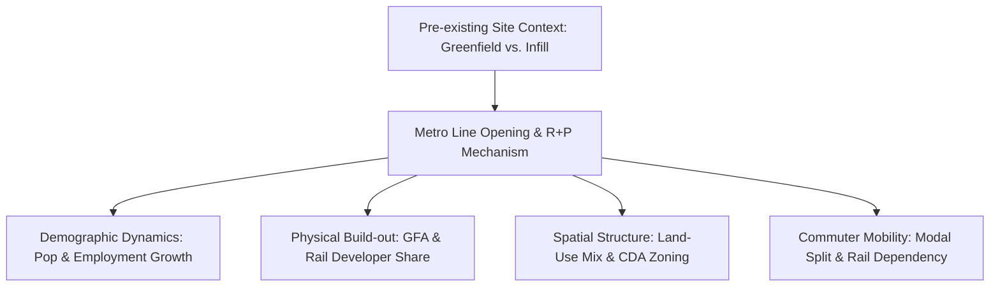

# Transit-oriented development on greenfield versus infill sites: Some lessons from Hong Kong

> [!summary] One-Sentence Positioning
> This empirical natural-experiment study evaluates the 5-to-10-year medium-term impacts of rail-based transit-oriented development (RTOD) across 17 station neighborhoods along Hong Kong's Tung Chung Line (greenfield) and West Rail Line (infill), revealing that while greenfield RTOD fosters rapid growth, master-planned developments, and transit reliance, infill RTOD retains higher density, employment vitality, and land-use mix.

## 1. Basic Information

| Field | Content |
|---|---|
| Authors | Becky P.Y. Loo, Amy H.T. Cheng, Samantha L. Nichols |
| Year | 2017 |
| Publication | Landscape and Urban Planning (Vol. 167, pp. 37–48) |
| DOI | 10.1016/j.landurbplan.2017.05.013 |
| Research Domain | Urban Transport Planning, Land Use Integration, Transit-Oriented Development |
| Research Type | Empirical Case Study / Quasi-Natural Experiment |
| Research Subject | Station-area neighborhood development dynamics (population, employment, floor area, land use, travel behavior) |
| Research Area | Hong Kong (Tung Chung Line & West Rail Line corridors) |
| Spatial Scale | Station Neighborhood Level (500-meter radial buffer around 17 stations) |
| Time Frame | 1993–2013 (evaluating baseline OY-5, opening year OY, OY+5, and OY+10) |

## 2. Research Background and Question

### 2.1 Research Background

Transit-Oriented Development (TOD) and Rail-based TOD (RTOD) are widely recognized strategies to combat urban sprawl, private vehicle dependency, traffic congestion, and environmental degradation by clustering dense, walkable, mixed-use communities around mass transit stations (PDF p. 37). While substantial literature has analyzed the financial success of metro investments and real estate price premiums under Hong Kong's "Rail plus Property" (R+P) framework, fewer studies systematically track how new rail corridors alter multi-dimensional urban development—including population, employment, land use diversity, and modal choices—over medium-to-long term horizons (PDF p. 38). Specifically, transit stations are constructed either in undeveloped or reclaimed peripheral areas ("greenfield sites") or within established urban fabric undergoing redevelopment ("infill sites") (PDF pp. 37–38).

### 2.2 Literature Gap

Existing station-area tracking research predominantly focuses on isolated metrics such as property prices, specific retail activities, or station ridership, often lacking comprehensive multi-variable evaluations across comparative urban settings within the same administrative jurisdiction (PDF p. 38). Prior comparative studies (e.g., BART in San Francisco, London, Madrid, or light rail vs. subway in Los Angeles) suffer from confounding variables such as differing rail technologies, mismatched time horizons, or qualitative-only corridor-level analyses (PDF p. 38). No previous study has systematically isolated and quantified medium-term (5–10 years post-opening) station-level socio-economic, spatial, land-use, and travel behavior transformations between greenfield and infill RTOD within a unified policy and socio-demographic setting (PDF p. 38).

### 2.3 Research Objectives and Research Questions

- **Research Objective**: To examine whether and how the medium-term impacts of rail transit on station-area neighborhoods differ when built on greenfield sites versus infill sites within a high-density metropolitan environment (PDF p. 38).
- **Primary Research Question**: Do the key socio-economic, structural, land-use, and travel characteristics of RTOD differ systematically between greenfield and infill railway station areas over a 5-to-10-year period following line operation? (PDF p. 37).
- **Hypotheses** (PDF p. 39):
  1. *H1*: Greenfield sites experience higher population growth rates than infill sites even 10 years post-operation.
  2. *H2*: Greenfield sites experience higher employment growth rates than infill sites in the medium term beyond 5 years.
  3. *H3*: The increase in Gross Floor Area (GFA) developed by the rail operator (versus non-rail developers) is greater on greenfield than infill sites.
  4. *H4*: Land-use diversity is greater in infill sites, but greenfield sites experience a greater increase in land-use diversity post-railway operation.
  5. *H5*: Residents in greenfield sites rely more heavily on rail transit for mobility than those in infill sites even 10 years after line opening.

## 3. Theoretical and Conceptual Framework

### 3.1 Core Concepts

| Concept | Definition / Usage in Paper | Operationalization | Obsidian Link |
|---|---|---|---|
| Rail-Based Transit-Oriented Development (RTOD) | High-density, walkable, mixed-use urban development centered within walking distance of heavy rail/metro transit stations (PDF pp. 37–38). | Analyzed within a 500m radial buffer around station centroids across socio-economic, GFA, land-use, and trip metrics. | [[Rail-Based Transit-Oriented Development]] |
| Greenfield Site | Undeveloped or newly reclaimed land with little or no pre-existing structures, requiring major new infrastructure provision (PDF p. 38). | Defined by baseline undeveloped/reclaimed land state prior to rail construction (8 stations along Tung Chung Line). | [[Greenfield Site]] |
| Infill Site | Previously developed or vacant urban land embedded within existing human settlements and major municipal infrastructure networks (PDF p. 38). | Defined by pre-existing urban infrastructure and settlement history prior to rail insertion (9 stations along West Rail Line). | [[Infill Site]] |
| Rail-plus-Property (R+P) Model | Hong Kong's institutional model where the transit operator is granted land development rights around station sites to fund rail infrastructure and capture real estate value (PDF pp. 39, 42). | Tracked through property ownership and GFA built by the rail developer versus non-rail private developers. | [[Rail-plus-Property Model]] |
| Comprehensive Development Area (CDA) | A statutory land-use zoning category in Hong Kong aimed at encouraging master-planned, balanced mixed-use development with public space and community amenities (PDF pp. 43–45). | Measured via Outline Zoning Plan (OZP) land use composition and conversion percentages. | [[Comprehensive Development Area]] |
| Land-Use Diversity | The degree of functional mix (residential, commercial, open space, GIC, industrial) within a station catchment area (PDF pp. 42–43). | Quantified by counting distinct land-use types from OZPs and mapping land conversion pathways. | [[Land-Use Diversity]] |

### 3.2 Theoretical Foundations

The study draws upon Calthorpe's (1993) and Cervero & Bernick's (1997) foundational theories of Transit-Oriented Development, as well as the 3D/5D framework (Density, Diversity, Design, Destination accessibility, Distance to transit) established by Ewing & Cervero (2010) (PDF pp. 37–38). It also builds on Knight & Trigg's (1977) early hypotheses regarding urban land take-up barriers in established areas versus vacant sites, and Smart Growth theories advocating infill high-density transit support (PDF p. 38).

### 3.3 Conceptual Relationships

The conceptual framework posits that pre-existing site context (Greenfield vs. Infill) interacts with Transit Infrastructure Delivery (Metro Line opening) under the R+P institutional mechanism, driving distinct medium-term trajectories across four dimensions: Socio-economic demographics (Population & Employment), Built environment intensity (GFA & Developer roles), Spatial structure (Land use diversity & CDA zoning), and Commuter behavior (Modal split & transit dependency) (PDF pp. 38–39).

## 4. Data and Methods

### 4.1 Research Design

The paper adopts an observational research design structured as a **quasi-natural experiment** (PDF pp. 38, 40). It compares two major rail corridors constructed during the same administrative era in Hong Kong:
- **Tung Chung Line (TCL)**: Opened in 1998, 30.5 km, 8 stations primarily on greenfield/reclaimed sites (PDF pp. 38–39).
- **West Rail Line (WRL)**: Opened in 2003, 30.5 km, 9 stations primarily on infill sites in established urban/suburban centers (PDF pp. 38–39).

### 4.2 Data

| Data / Sample | Source | Quantity & Time | Spatial Granularity | Purpose | Limitations |
|---|---|---|---|---|---|
| Socio-economic Data | Census and Statistics Dept. (HKSAR) | Tertiary Planning Unit (TPU) censuses (TCL: 1993, 1998, 2003, 2008; WRL: 1998, 2003, 2008, 2013) | Tertiary Planning Unit (TPU) | Estimate population and employment size and density around stations | Pro rata estimation required when TPU boundaries do not align with 500m buffers; missing baseline data on reclaimed greenfield land (PDF p. 40). |
| Gross Floor Area (GFA) Data | Property annual reports, official websites, survey map estimations | 313 properties (158 greenfield, 155 infill); 64 extracted directly, 249 estimated | Building / Property level | Quantify development intensity and developer share (rail vs. non-rail) | 249 property GFAs were estimated via typical floor area or flat count approximations (PDF p. 40). |
| Statutory Land Use Plans | Outline Zoning Plans (OZPs) from Planning Dept. | OZPs matching baseline and post-opening evaluation years | 500m radial buffer | Measure land-use composition, diversity, and conversion maps | OZPs reflect statutory planning intention rather than 100% realized building use (PDF p. 40). |
| Travel Behavior Data | Travel Characteristics Surveys (TCS) by Transport Dept. | 2001 and 2011 TCS survey microdata | Station 500m catchment | Assess modal split, trip generation, and rail dependency | TCS conducted only every 10 years; 2001 reflects early TCL post-opening, small sample sizes prevented parametric tests (PDF pp. 40–41). |

### 4.3 Methodological Process

1. **Spatial Buffer Generation**: Construct a 500-meter radial buffer (10-minute walk catchment) around the centroid of each of the 17 stations (PDF p. 40).
2. **Pro Rata Socio-Economic Estimation**: Overlay TPU statistical boundaries with station buffers; calculate population and employment metrics proportionally based on buffer area overlay ratios (PDF p. 40).
3. **GFA & Developer Disaggregation**: Catalog all 313 developments within buffers; disaggregate GFA into rail-developer vs. non-rail private developer properties at OY and OY+5 (PDF p. 40).
4. **Land Use GIS & Conversion Mapping**: Digitize OZP zoning maps for before-and-after periods; calculate land-use mix count and plot spatial conversion matrices (PDF pp. 40, 43–44).
5. **Travel Behavior Analysis**: Extract modal split (rail-only, multimodal rail, bus, private car) from TCS 2001 and 2011 data for residents within buffers (PDF pp. 40–41, 45).

### 4.4 Models, Metrics, and Variables

| Name | Type | Definition or Calculation Method | Role in Study |
|---|---|---|---|
| Population Density | Metric / Dependent | Total population in 500m buffer divided by land area ($	ext{persons/km}^2$) | Measures residential concentration post-rail (PDF p. 41). |
| Employment Density | Metric / Dependent | Total jobs in 500m buffer divided by land area ($	ext{jobs/km}^2$) | Measures economic agglomeration post-rail (PDF p. 42). |
| GFA Density | Metric / Dependent | Total gross floor area ($m^2$) divided by 500m buffer land area ($	ext{m}^2/	ext{km}^2$) | Measures urban physical build-out intensity (PDF p. 43). |
| Rail Developer Share (%) | Variable / Dependent | $(	ext{Rail Developer GFA} / 	ext{Total Buffer GFA}) 	imes 100\%$ | Evaluates rail operator's role in transformation (PDF p. 43). |
| Land-Use Diversity Count | Metric / Dependent | Number of distinct statutory land use categories present in 500m buffer | Assesses functional integration/mix (PDF pp. 42–43). |
| Transit Modal Share (%) | Metric / Dependent | Percentage of daily trips taken by rail-only or multimodal transit | Evaluates commuter rail reliance (PDF p. 45). |

### 4.5 Methodological Evaluation

- **Soundness**: High internal validity achieved by treating TCL and WRL as a quasi-natural experiment within a single jurisdiction, holding governance, tax, and transit-pricing regimes constant (PDF pp. 38, 40).
- **Improvements over Prior Studies**: Standardizes spatial catchments (500m buffers) and multi-temporal windows (OY-5 to OY+10) across both greenfield and infill lines simultaneously, combining demographic, spatial, physical GFA, and behavioral metrics (PDF p. 38).
- **Potential Biases & Validity Risks**:
  - *Pro Rata Spatial Distortion*: Area-proportioning across TPU polygons assumes uniform density within TPUs, potentially overestimating or underestimating edge densities (PDF p. 40). [Analytical Synthesis]
  - *GFA Estimation Error*: 249 of 313 property GFAs relied on average flat size or floor plate approximations rather than official building blueprints (PDF p. 40). [Analytical Synthesis]
  - *Small Sample Size*: 8 greenfield vs. 9 infill stations precluded statistical significance testing (e.g., t-tests or difference-in-differences regressions) (PDF p. 41).
- **Reproducibility Information Needed**: Precise TPU overlay polygons and exact building-level GFA estimation algorithms are not fully tabulated in the text (PDF p. 40). [Analytical Synthesis]

## 5. Main Findings

### 5.1 Core Findings

1. **Population Dynamics**: Greenfield sites achieved dramatically higher relative population growth rates (51.3% at 5 yrs, 74.9% at 10 yrs post-opening) compared to infill sites (5.9% at 5 yrs, 11.1% at 10 yrs) (PDF p. 41). However, 10 years post-opening, absolute population density on infill sites ($36,598.8	ext{ persons/km}^2$) remained 63.2% higher than on greenfield sites ($22,425.8	ext{ persons/km}^2$) (PDF p. 41).
2. **Employment Agglomeration**: Greenfield sites grew employment faster (49.4% at 5 yrs, 122.0% at 10 yrs) than infill sites (13.9% at 5 yrs, 22.8% at 10 yrs) (PDF p. 42). Yet infill sites maintained far higher absolute job densities ($17,945	ext{ jobs/km}^2$ vs. $14,285	ext{ jobs/km}^2$ at 10 yrs), driven by traditional market centers like Tsuen Wan West ($23,130	ext{ jobs/km}^2$) (PDF p. 42).
3. **Rail Operator Development Dominance**: On greenfield sites, the rail developer commanded 39.8% of total GFA by 5 years post-opening, compared to only 12.3% on infill sites (PDF p. 43). Non-rail private developers dominated infill land (87.7% GFA), though the rail developer still spearheaded 65.5% of net new GFA expansion on infill sites (PDF p. 43).
4. **Land-Use Diversity & CDA Dominance**: Infill sites retained higher overall land-use diversity (6–9 land-use types) than greenfield sites (4–8 types) (PDF pp. 42–43). Counterintuitively, land-use diversity slightly *decreased* in 4 out of 8 greenfield stations post-rail opening because fine-grained land parcels were consolidated into master-planned **Comprehensive Development Areas (CDA)** (PDF pp. 43–45).
5. **Commuter Travel Behavior**: Residents in greenfield station areas developed significantly higher rail reliance. By 2011, 9.3% of greenfield residents used rail exclusively and 27.1% used multimodal rail options, compared to 3.1% rail-only and 7.0% multimodal rail among infill residents (PDF p. 45).

### 5.2 Secondary Findings and Anomalies

- **Population / Employment Decline at Infill Stations**: Stations B2 (Mei Foo) and B9 (Tuen Mun) experienced net population or employment declines post-rail opening due to land clearance for railway construction, commercialization, and regional industrial decline in the New Territories (PDF pp. 41–42).
- **Outlier Greenfield Performance**: Station A8 (Tung Chung) exhibited explosive growth in both population (+19,588.9% over 10 yrs) and employment (+88,700%), serving as a major new town core, whereas A7 (Sunny Bay) recorded zero residential or commercial build-out as it functions solely as an interchange for Hong Kong Disneyland (PDF pp. 41–42).

### 5.3 Research Question / Hypothesis Matrix

| Research Question / Hypothesis | Corresponding Result | Supported? | Evidence Location |
|---|---|---|---|
| *H1*: Greenfield population growth rate > Infill | Greenfield: +51.3% (5y), +74.9% (10y); Infill: +5.9% (5y), +11.1% (10y). | Supported | Table 2 (PDF p. 41) |
| *H2*: Greenfield employment growth rate > Infill | Greenfield: +49.4% (5y), +122.0% (10y); Infill: +13.9% (5y), +22.8% (10y). | Supported | Table 3 (PDF p. 42) |
| *H3*: Rail developer GFA share Greenfield > Infill | Rail developer GFA share at 5y: Greenfield 39.8% vs. Infill 12.3%. | Supported | Table 4 (PDF p. 43) |
| *H4*: Infill higher land-use mix; Greenfield greater diversity increase post-rail | Infill mix higher (6-9 vs 4-8), but Greenfield diversity did NOT increase overall due to CDA parcel consolidation. | Partially Supported | Tables 5–7 (PDF pp. 42–44) |
| *H5*: Greenfield residents rely more on rail transit than Infill | Greenfield rail split (9.3% rail-only + 27.1% multimodal) vs. Infill (3.1% rail-only + 7.0% multimodal). | Supported | Section 5.3, Table 10 (PDF p. 45) |

## 6. Discussion and Contributions

### 6.1 Theoretical Contributions

Refines TOD literature by proving that urban site provenance (greenfield vs. infill) fundamentally dictates the temporal rate, physical structure, and behavioral outcomes of transit investments (PDF pp. 45–46). Demonstrates that high infrastructure costs on greenfield sites are offset by master-planning opportunities, whereas infill TOD faces structural spatial inertia despite high existing land values (PDF p. 46).

### 6.2 Methodological Contributions

Establishes a repeatable quasi-natural experiment framework combining socio-economic census buffers, GFA developer attribution, statutory OZP mapping, and Travel Characteristics Survey data across parallel rail corridors (PDF pp. 40, 46).

### 6.3 Empirical Contributions

Provides fine-grained, 10-year longitudinal empirical evidence on 17 station neighborhoods in Hong Kong, quantifying the exact GFA shares of rail vs. non-rail developers and documenting the parcel consolidation effects of CDA master-planning (PDF pp. 41–45).

### 6.4 Practical or Policy Implications

- **Master-Planned Greenfield TOD**: Greenfield sites offer clean slates for innovative, master-planned podium development (CDAs), but planners must actively guard against mono-functional residential enclaves and spatial privatization (PDF p. 46).
- **Infill Regeneration**: Infill TOD excels at revitalizing legacy commercial nodes (e.g., Yuen Long), but municipal intervention is needed to navigate complex land assembly and utility retrofits (PDF p. 46).

## 7. Limitations and Future Research

### 7.1 Author-Acknowledged Limitations

- Periodic Travel Characteristics Surveys (TCS) conducted only once every 10 years limited before-and-after travel behavioral matching (PDF pp. 40–41).
- Small station sample sizes (8 greenfield, 9 infill) precluded statistical significance testing such as difference-of-means (PDF p. 41).
- Inability to distinguish whether buffer commuters were long-term residents or newly relocated households (PDF p. 41).

### 7.2 Further Identified Limitations

- **Ecological and Environmental Omission**: The paper treats greenfield land purely as spatial "vacant/reclaimed" opportunity areas without accounting for ecosystem service loss, wetland degradation, or environmental externalities—a critical gap when evaluating peripheral developments near sensitive habitats (PDF p. 38). [Analytical Synthesis]
- **Pro Rata Spatial Distortion**: Uniform area-proportioning across TPU polygons overlooks non-linear spatial clustering along major transit spines (PDF p. 40). [Analytical Synthesis]

### 7.3 Future Research Directions

- *Authors' Suggestion*: Long-term (>15–20 years) tracking of station areas and broader comparative studies in other Asian hyper-dense metros (PDF p. 46).
- *Analytical Suggestion*: Integrating ecological impact assessments and natural capital evaluation into greenfield RTOD frameworks near rural/wetland fringes. [Analytical Synthesis]

## 8. Key Evidence and Quotable Content

| Purpose | Text (Verbatim Quotation or Precise Paraphrase) | Page | Usage Note |
|---|---|---|---|
| Definition | Infill development is defined as "the more intensive use of a site... with existing infrastructure such as power, water, sewerage, transport and telecommunications." | PDF p. 38 | Cite when defining infill baseline conditions. |
| Greenfield Cost | Greenfield sites "refer to a piece of land not in active use... and any new development will require substantial infrastructural development." | PDF p. 38 | Cite when discussing upfront infrastructure burdens. |
| Findings | "Infill site development has indeed been more successful in re-generating employment growth, housing new population, or both and also has a more healthy mix of land uses." | PDF p. 37 | Cite for infill employment and density strengths. |
| Policy Insight | In greenfield sites, "RTOD provided the opportunity to reshape the built environment and introduce more innovative planning concepts like 'comprehensive development'." | PDF p. 37 | Cite when evaluating CDA master-planning benefits. |

## 9. Relationship to My Research

*User Research Question*: What are the key environmental and structural limitations of Hong Kong’s traditional "Rail plus Property" TOD framework when deployed in ecologically sensitive wetland ecosystems in the Northern Metropolis?

- **Applicable Theories**: The paper's baseline framework on R+P infrastructure finance and greenfield development mechanics (PDF p. 38) provides the direct institutional baseline against which Northern Metropolis greenfield extensions must be critically evaluated.
- **Reusable Methods & Metrics**: The 500m buffer pro rata demographic overlay, GFA developer attribution (Rail vs. Non-rail), and OZP land conversion mapping (PDF p. 40) can be directly replicated to analyze proposed Northern Metropolis railway station catchments (e.g., San Tin, Kwu Tung).
- **Comparable Cases**: The Tung Chung Line greenfield stations (A8 Tung Chung, A7 Sunny Bay, A4 Nam Cheong) serve as direct historical precedents of R+P deployed on undeveloped/reclaimed peripheral sites.
- **Supportive Arguments**: Confirms that traditional R+P on greenfield sites relies heavily on massive high-density GFA maximization (CDAs) led by the transit operator to recover infrastructure costs (PDF pp. 42–43).
- **Potential Conflicting / Critical Views**: Loo et al. (2017) frame greenfield sites as "unbuilt/vacant" opportunities for master-planned urban growth (PDF p. 38). However, applying this density-maximization R+P template to the Northern Metropolis wetlands exposes severe **environmental and structural limitations**:
  1. *Ecosystem Fragmentation*: Standard high-density podium CDAs disturb hydrological regimes and wetland habitats.
  2. *Structural Rigidity*: Traditional R+P requires high-density financial yield, which conflicts directly with strict statutory wetland conservation buffers (Wetland Conservation Area / Wetland Buffer Area).
  3. *Land-Use Monoculture*: As Loo et al. show, greenfield R+P often leads to large single-developer CDAs that reduce fine-grained land mix, potentially creating privatized high-rise enclaves insensitive to surrounding rural/ecological contexts.
- **Research Gaps to Advance**: Extend Loo et al.'s framework by incorporating **ecological constraints, biodiversity metrics, and wetland buffer regulations** into the evaluation of greenfield R+P deployment in the Northern Metropolis.

## 10. Literature Network

### 10.1 Strong-Relation Papers

| Correlated Paper | Relation Type | Relation Explanation | Basis | Confidence | Note Status |
|---|---|---|---|---|---|
| [[Calthorpe_1993_TOD]] | Theoretical Foundation | Provides the foundational definition of Transit-Oriented Development as walkable, mixed-use station communities. | PDF p. 37 | High | Pending |
| [[Cervero_1997_TOD]] | Theoretical Foundation | Framework for transit-supportive land uses and smart growth infill development principles. | PDF pp. 37–38 | High | Pending |
| [[Ewing_2010_Travel_Built_Environment]] | Theoretical Foundation | Establishes the built environment 3D/5D metrics (density, diversity, design) influencing travel choice. | PDF pp. 37–38 | High | Pending |
| [[Lo_2008_Rail_Property]] | Theoretical / Case | Analyzes Hong Kong's Rail-plus-Property (R+P) institutional model and property value capture mechanics. | PDF pp. 38–39 | High | Pending |
| [[Loo_2010_TOD_Ridership]] | Methodological | Utilizes 500m spatial buffer catchments to evaluate transit ridership and station-area characteristics in Hong Kong. | PDF pp. 37–38, 40 | High | Pending |
| [[Houston_2015_Light_Rail_Subway]] | Empirical | Comparative corridor evaluation of transit investments across different urban built environments. | PDF p. 38 | Medium | Pending |

### 10.2 Concept, Method, and Case Nodes

| Node | Type | Role in Paper | Suggested Connection Direction |
|---|---|---|---|
| [[Rail-Based Transit-Oriented Development]] | Concept | Main analytical concept evaluating station neighborhood performance. | Connect to TOD policy, land-use integration, and high-density transit literature. |
| [[Greenfield Site]] | Context / Concept | Baseline spatial condition representing undeveloped/reclaimed land prior to rail insertion. | Connect to suburban expansion, new town planning, and environmental impact studies. |
| [[Infill Site]] | Context / Concept | Baseline spatial condition representing built-up urban fabric undergoing redevelopment. | Connect to urban regeneration, smart growth, and brownfield redevelopment papers. |
| [[Rail-plus-Property Model]] | Mechanism / Policy | Institutional financial mechanism enabling Hong Kong's transit-land integration. | Connect to land value capture, urban infrastructure finance, and transit governance studies. |
| [[Comprehensive Development Area]] | Statutory Tool | Statutory zoning tool used by rail operators to create master-planned mixed-use pods. | Connect to master planning, urban design, and land parcel assembly literature. |
| [[Quasi-Natural Experiment]] | Method | Observational research design comparing TCL (greenfield) and WRL (infill) corridors. | Connect to empirical impact evaluation and urban policy analysis methods. |
| [[Gross Floor Area Estimation]] | Method | Technique for cataloging physical built density and developer market share. | Connect to real estate economics and urban density mapping. |
| [[Tung Chung Line]] | Case | Representative heavy rail line servicing greenfield/reclaimed station areas in Hong Kong. | Connect to Hong Kong New Towns and airport infrastructure expansion studies. |
| [[West Rail Line]] | Case | Representative heavy rail line servicing infill urban and established market nodes. | Connect to Northwest New Territories and urban renewal research. |

### 10.3 Network Summary

Loo et al. (2017) occupies a central bridging position in the high-density TOD literature by establishing an empirical baseline for how spatial site provenance (greenfield vs. infill) conditions the performance of Hong Kong's Rail-plus-Property (R+P) mechanism. It extends Calthorpe (1993) and Cervero (1997) by testing TOD principles in a hyper-dense Asian metropolis, while operationalizing Ewing & Cervero's (2010) built environment dimensions via a quasi-natural experiment design. For research on the Northern Metropolis, this paper serves as the indispensable benchmark showing how greenfield R+P historically operates—highlighting its structural dependency on dense GFA maximization and CDA master-planning, which directly clashes with modern wetland conservation mandates.

## 11. Post-Reading Research Memorandum

> [!question] Questions Worth Pursuing
> 1. How can the high-density financial yield requirements of Hong Kong's traditional Rail-plus-Property (R+P) model be reconciled with ecological preservation mandates in the Northern Metropolis wetlands?
> 2. Does the parcel-consolidation effect of Comprehensive Development Areas (CDAs) observed on greenfield sites create ecological barrier effects that disrupt wetland wildlife corridors?
> 3. What alternative land value capture or co-development mechanisms can replace traditional R+P when GFA densities near sensitive greenfield sites must be strictly capped?

> [!idea] Transferable Methods or Ideas
> - **Multi-Temporal Buffer Analysis**: Replicate the 500m buffer pro rata overlay across OY-5, OY, OY+5, and OY+10 years to track spatial change surrounding proposed Northern Metropolis station centroids.
> - **Developer Disaggregation Matrix**: Classify built GFA into rail operator vs. private developer shares to reveal institutional driving forces in eco-TOD zones.

> [!warning] Limitations When Applying
> - The paper treats greenfield land purely as "vacant/unbuilt space" ripe for development density, completely ignoring ecological capital, ecosystem services, and wetland buffer zoning regulations.
> - Conclusions reflect pre-2014 urban conditions and must be adapted to contemporary ESG, biodiversity, and climate-resilience planning guidelines.

## 12. Reference Leads

| Recommended Note Link | Reason for Recommendation | Relationship to Current Paper | Priority |
|---|---|---|---|
| [[Calthorpe_1993_The_Next_American_Metropolis]] | Foundational text defining TOD design principles, pedestrian pockets, and regional transit integration. | Theoretical Foundation | High |
| [[Cervero_1997_Transit_Oriented_Development]] | Benchmark synthesis of TOD strategies, transit joint development, and land use integration. | Theoretical Foundation | High |
| [[Ewing_2010_Travel_and_the_Built_Environment]] | Comprehensive meta-analysis of built environment dimensions (D-variables) and travel behavior. | Theoretical Foundation | High |
| [[Lo_2008_Building_Railway_and_Property]] | Detailed institutional analysis of Hong Kong's Rail-plus-Property (R+P) development mechanism. | Institutional Baseline | High |
| [[Loo_2010_Rail_Based_TOD_Ridership]] | Establishes the 500m spatial buffer methodology and transit accessibility metrics in Hong Kong. | Methodological Source | High |
| [[Knight_1977_Evidence_on_Transit_Impacts]] | Early seminal study identifying urban site take-up barriers in established vs. undeveloped transit corridors. | Historical Baseline | Medium |
| [[Giannakodakis_2013_Infill_vs_Greenfield]] | Comparative infrastructure cost analysis comparing infill vs. greenfield development burdens. | Conceptual Source | Medium |
| [[Houston_2015_Comparative_Transit_Corridors]] | Empirical comparison of built environment changes along light rail vs. heavy subway corridors in LA. | Methodological Control | Medium |

## 13. Minimal Review

- **One-Sentence Research Question**: Do medium-term socio-economic, spatial, and travel impacts of rail transit differ systematically between greenfield and infill station neighborhoods?
- **One-Sentence Method**: A quasi-natural experiment comparing 17 station catchments (500m buffers) along Hong Kong's Tung Chung Line (greenfield) and West Rail Line (infill) using demographic, GFA, zoning, and survey data over 10 years.
- **One-Sentence Finding**: Greenfield RTOD drives rapid population/employment growth, master-planned CDAs, and high rail reliance, whereas infill RTOD preserves higher baseline density, land-use diversity, and commercial vitality.
- **One-Sentence Contribution**: Empirically demonstrates the critical role of pre-existing site context and rail-developer GFA dominance in shaping TOD evolution under Hong Kong's R+P model.
- **One-Sentence Limitation**: Small sample size, reliance on pro rata spatial estimations, and total exclusion of ecological/environmental capital metrics on greenfield sites.
- **Worth In-Depth Reading**: Yes
- **Recommended Priority**: ★★★★★