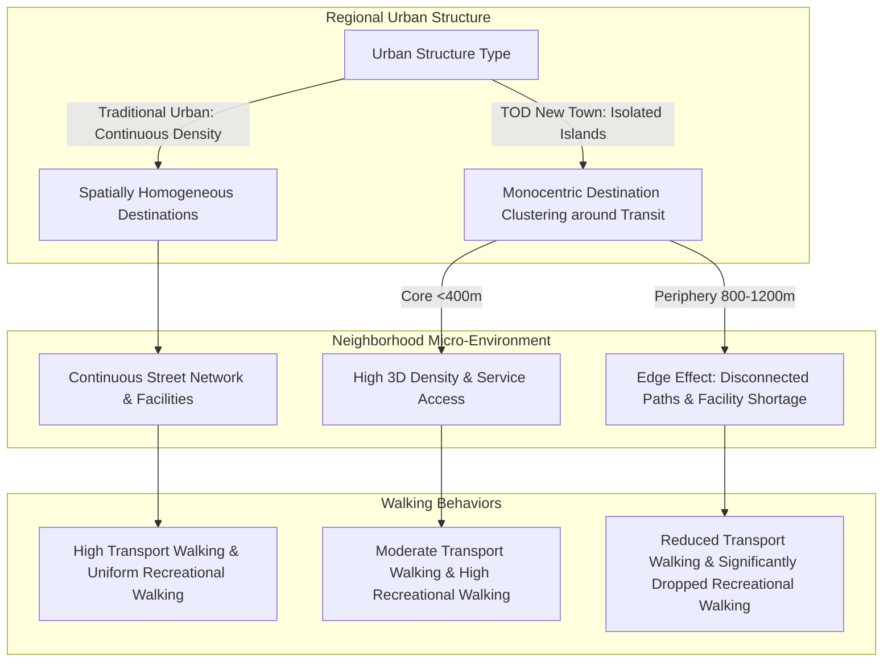

# Do Transit-Oriented Developments (TODs) and Established Urban Neighborhoods Have Similar Walking Levels in Hong Kong?

> [!summary] Summary
> This study investigates whether transit-oriented development (TOD) new towns and established urban neighborhoods in Hong Kong exert similar influences on transportation and recreational walking behaviors among public housing residents. Utilizing public housing random assignment as a natural experiment to control for residential self-selection bias, the study demonstrates that TOD residents walk less for transportation, and peripheral TOD residents (800–1200 m from MTR) exhibit significantly reduced recreational walking due to spatial monocentric clustering and pedestrian infrastructure edge effects.

## 1. Basic Information

| Field | Content |
|---|---|
| Authors | Yi Lu, Zhonghua Gou, Yang Xiao, Chinmoy Sarkar, John Zacharias |
| Year | 2018 |
| Source | International Journal of Environmental Research and Public Health, 15(3), 555 |
| DOI | 10.3390/ijerph15030555 |
| Research Domain | [[Transit-Oriented Development]], [[Built Environment]], [[Active Transportation]] |
| Research Type | Empirical Study / Natural Experiment |
| Research Object | Public housing adult residents (ages 18–64) |
| Study Area | [[Hong Kong]] ([[Kowloon]] and [[New Territories]]) |
| Spatial Scale | [[Neighborhood Scale]] (400 m and 800–1200 m station buffers), [[City Scale]] |
| Time Range | 2016 (Data collection) |

## 2. Research Background and Questions

### 2.1 Research Background
Rapid urbanization in mainland China has been accompanied by a sharp decline in physical activity (32% reduction between 1991 and 2006) and surging adult obesity rates reaching 20% in major urban areas (PDF pp. 1–2). To combat physical inactivity and related non-communicable chronic diseases, urban planners and public health officials have increasingly promoted Transit-Oriented Development (TOD) (PDF p. 2). Hong Kong is widely recognized as a high-density benchmark exemplar for TOD implementation in Asian compact cities (PDF p. 2). It presents a unique urban structure comprising traditional, pre-WWII compact urban areas in Kowloon/Hong Kong Island and high-density TOD new towns built since the 1970s along Mass Transit Railway (MTR) corridors in the New Territories (PDF p. 2).

### 2.2 Literature Gap
Existing literature suffers from three critical limitations (PDF pp. 5–6):
1. **Unverified Equivalence Assumption**: Prior Western literature frequently used established urban neighborhoods as proxies for TODs, implicitly assuming identical impacts on walking due to shared features like high density and land-use mix. However, Asian TOD new towns differ structurally from traditional urban cores in *density continuity* (new towns are discrete islands bounded by open rural land, whereas traditional urban areas form a continuous urban fabric) and *job/destination density* (PDF p. 5).
2. **Contextual Generalizability**: Most TOD studies originate from Western car-dependent, low-density suburban contexts. Empirical evidence regarding whether Western TOD principles function effectively in high-density, low-car-ownership Asian contexts (Hong Kong car ownership: 0.07 per person) remains sparse (PDF pp. 5–6).
3. **Residential Self-Selection Bias**: Cross-sectional studies struggle to prove causality because physically active individuals may intentionally choose walking-friendly neighborhoods. Random housing allocation designs are rare in environmental active travel literature (PDF p. 6).

### 2.3 Research Objectives and Questions
- **Research Objectives**: To empirically compare transportation and recreational walking levels between traditional urban neighborhoods and TOD new towns in Hong Kong, controlling for distance to MTR stations and residential self-selection bias (PDF p. 6).
- **Research Questions**:
  1. Do TOD new towns and established urban neighborhoods generate equivalent transportation and recreational walking behaviors? (PDF p. 5)
  2. Does an "edge effect" lower walking levels among peripheral TOD residents living far (800–1200 m) from rail stations compared to core TOD residents (<400 m)? (PDF p. 5)
- **Hypotheses**:
  - *H1*: New town residents have lower walking levels than traditional urban residents due to macro spatial isolation and lower job/service density (PDF p. 5).
  - *H2*: An "edge effect" exists in peripheral new town estates (800–1200 m from station), leading to reduced walking compared to core estates (<400 m), whereas continuous traditional urban neighborhoods show no such edge effect (PDF p. 5).

## 3. Theoretical and Conceptual Framework

### 3.1 Core Concepts

| Concept | Definition / Usage in Paper | Operationalization | Obsidian Link |
|---|---|---|---|
| Transit-Oriented Development (TOD) | High-density, mixed-use, pedestrian-friendly urban form centered around public mass transit nodes (PDF p. 2). | New towns built in the New Territories along MTR corridors post-1970 (PDF p. 6). | [[Transit-Oriented Development]] |
| Transportation Walking | Walking from place to place for utilitarian travel purposes, excluding recreational activity (PDF p. 7). | Self-reported weekly minutes of transport walking via IPAQ (PDF p. 7). | [[Transportation Walking]] |
| Recreational Walking | Walking conducted solely for exercise, recreation, or leisure (PDF p. 7). | Self-reported weekly minutes of leisure walking via IPAQ (PDF p. 7). | [[Recreational Walking]] |
| Edge Effect (Urban Planning) | The phenomenon where peripheral areas of isolated developments suffer a decline in design exposure and pedestrian infrastructure quality (PDF p. 5). | Comparison between core housing estates (<400 m from MTR) and peripheral estates (800–1200 m) abutting rural land (PDF pp. 6–7). | [[Edge Effect in Urban Planning]] |
| Residential Self-Selection | The confounding bias where individuals select residential locations matching their prior travel preferences or activity habits (PDF p. 6). | Controlled by sampling public housing residents allocated flats via random computer batching (PDF p. 6). | [[Residential Self-Selection]] |

### 3.2 Theoretical Foundations
The paper builds on built environment frameworks in active transportation:
- **3Ds Framework** (Density, Diversity, Design) by Ewing & Cervero (PDF p. 5) [[3Ds Framework]].
- **5Ds Framework** (adding Distance to transit and Destination accessibility) (PDF p. 5) [[5Ds Framework]].
- **3D + R Framework** (Density, Distance, Destination + Route) (PDF p. 5).

The authors adapt these frameworks by arguing that regional-scale spatial continuity and spatial homogeneity of destinations modify local-level 3D design effects (PDF pp. 5, 10).

### 3.3 Conceptual Relationships

## 4. Data and Methods

### 4.1 Research Design
A natural experiment and cross-sectional comparative study across 20 stratified public housing estates in Hong Kong. The allocation mechanism of the Hong Kong Housing Authority serves as a natural quasi-randomization mechanism to eliminate residential self-selection bias (PDF p. 6).

### 4.2 Data

| Data / Sample | Source | Quantity & Time | Spatial Granularity | Purpose | Limitations |
|---|---|---|---|---|---|
| Individual Survey Data | Face-to-face interviews using IPAQ | N = 616 adults (30–35 per estate); Collected in 2016 | Individual level | Outcome measures (walking minutes) & demographics | Self-reported data subject to recall bias (PDF p. 11) |
| Housing Estate Selection | HK Housing Authority public housing scheme | 20 selected estates across 4 stratified groups | Housing estate level | Natural experiment sampling frame | Exclusive to low-and-medium income groups (HK$12k–15k) (PDF p. 7) |
| Built Environment Data | Hong Kong GIS datasets (ArcGIS 10.5) | 20 estates | 800 m straight-line buffer around estates | Control variables (intersection density, land-use mix, pop density) | Buffer area fixed at 800 m (PDF p. 7) |
| Census Data | HK Census and Statistics Department | 2015 Census Data | District / Estate level | Income baseline verification & commuting modal splits (PDF p. 6) | Aggregate level data |

### 4.3 Methodological Process

1. **Estate Stratification & Selection**: Stratification of 20 public housing estates into a 2 × 2 matrix:
   - Traditional Urban vs. TOD New Town
   - Close to MTR (<400 m) vs. Far from MTR (800–1200 m, on new town outskirts abutting rural open space) (PDF pp. 6–7).
   - Household income controlled within HK$12,000–HK$15,000 (PDF p. 7).
2. **Participant Intercept Survey**: Intercept sampling at estate entrances/exits in 2016 to recruit 616 eligible adult residents (aged 18–64, residing >1 year). Administered face-to-face IPAQ questionnaires (PDF p. 7).
3. **GIS Built Environment Extraction**: Calculated population density, land-use mix index, and street intersection density within an 800 m straight-line buffer around each estate center using ArcGIS 10.5 (PDF p. 7).
4. **Multilevel Statistical Modeling**: Fitted two separate two-level mixed-effects linear regression models in R (`lme4` package) to account for participant clustering (Level 1) within housing estates (Level 2) (PDF p. 7).

### 4.4 Models, Metrics, and Variables

| Name | Type | Definition / Calculation Method | Role in Study |
|---|---|---|---|
| Transportation Walking | Dependent Variable | Self-reported transport walking duration (min/week) via IPAQ (PDF p. 7). | Primary Outcome 1 |
| Recreational Walking | Dependent Variable | Self-reported leisure/exercise walking duration (min/week) via IPAQ (PDF p. 7). | Primary Outcome 2 |
| Neighborhood Type | Independent Variable | Binary: Traditional Urban (Kowloon) vs. TOD New Town (New Territories) (PDF p. 6). | Main Predictor 1 |
| Distance to MTR | Independent Variable | Categorical: Close (<400 m walking distance) vs. Far (800–1200 m walking distance) (PDF pp. 6–7). | Main Predictor 2 |
| Land-Use Mix | Control Variable | Entropy index of land use diversity within 800 m buffer (PDF p. 7). | Built Environment Control |
| Intersection Density | Control Variable | Number of street intersections per unit area within 800 m buffer (PDF p. 7). | Built Environment Control |
| Population Density | Control Variable | Population per square kilometer within 800 m buffer (PDF p. 7). | Built Environment Control |
| Demographic & SES | Control Variables | Age (18–34, 35–49, 50–64), Gender, Household income level (PDF p. 7). | Individual Controls |

*Note: No key mathematical formulas were explicitly defined in LaTeX format in the text beyond standard multilevel regression specifications.*

### 4.5 Methodological Evaluation

- **Methodological Soundness**: High. Utilizing public housing random allocation effectively addresses the widespread residential self-selection bias in built environment-health literature (PDF p. 6).
- **Improvements over Existing Methods**: Replaces observational cross-sectional assumptions with a natural experiment design; decomposes walking into domain-specific types (transport vs. recreation) (PDF p. 7).
- **Potential Biases & Validity Threats**: Convenience intercept sampling may introduce selection bias. Self-reported IPAQ walking data is subject to recall errors (PDF p. 11). Focus on low-to-middle-income public housing residents restricts external validity to private/high-income sectors (PDF p. 11).
- **Missing Information for Full Replication**: Detailed spatial definitions of land-use entropy categories and exact survey question wording are omitted (Analytical Synthesis).

## 5. Main Findings

### 5.1 Core Findings

1. **Lower Transportation Walking in TOD New Towns**:
   - *Finding*: Public housing residents in TOD new towns walked significantly less for transportation purposes compared to traditional urban residents ($eta = -0.60, 95\% 	ext{ CI } [-1.18, -0.03], p = 0.04$) (PDF pp. 8–9, Table 2).
   - *Author Explanation*: Traditional urban cores have higher job density, continuous commercial frontages, and a denser distribution of daily retail destinations throughout the fabric, whereas TOD new towns suffer from jobs-housing imbalance and monocentric clustering of commercial uses strictly around rail stations (PDF p. 9).

2. **Significant Edge Effect on Recreational Walking in Peripheral TOD Estates**:
   - *Finding*: A significant interaction effect existed between neighborhood type and distance to MTR for recreational walking ($eta = -0.23, 95\% 	ext{ CI } [-0.43, -0.03], p = 0.02$). Post-hoc analysis showed that TOD residents far from stations (800–1200 m) walked significantly less for recreation than TOD residents close to stations (<400 m) ($eta = -0.57, 95\% 	ext{ CI } [-1.07, -0.07], p = 0.03$) (PDF pp. 8–9, Table 2).
   - *Author Explanation*: Outer-edge TOD estates suffer from lower intersection density, circuitous pedestrian paths aligned with highway engineering, fewer recreational facilities (mean facility count = 21.2 in new towns vs. 31.8 in urban areas), and poor pedestrian connection to surrounding rural open space (PDF p. 10).

3. **Absence of Edge Effect in Traditional Urban Neighborhoods**:
   - *Finding*: In traditional urban areas, distance to MTR station had no significant impact on recreational walking ($eta = 0.17, 95\% 	ext{ CI } [-2.92, 3.25], p = 0.62$) (PDF p. 9).
   - *Author Explanation*: Traditional urban neighborhoods feature spatially homogenous pedestrian infrastructure, continuous gridiron street networks, and uniform distribution of commercial and recreational services (PDF p. 10).

4. **Distance to MTR Does Not Dictate Transport Walking in High-Density Contexts**:
   - *Finding*: Distance to MTR station had no significant main effect ($p = 0.37$) or interaction effect ($p = 0.83$) on transportation walking (PDF pp. 8–9, Table 2).
   - *Author Explanation*: High public transit dependency and extremely low car ownership (0.07 cars/person) force peripheral residents to walk longer distances to reach transit nodes or daily services, offsetting the proximity advantage of core residents (PDF p. 9).

### 5.2 Secondary Findings and Anomalies
- New town housing estates far from transit stations are often adjacent to open rural spaces, yet residents make less recreational walking than urban residents surrounded by high-density urban fabric (PDF pp. 4, 10). This counter-intuitive finding reveals that physical proximity to rural open space does not translate into active recreation if pedestrian connectivity and facility provision are deficient (Analytical Synthesis).

### 5.3 Research Questions Mapping

| Research Question / Hypothesis | Corresponding Result | Supported? | Evidence Location |
|---|---|---|---|
| H1: TOD new town residents have lower walking levels than traditional urban residents. | TOD residents walk significantly less for transportation ($eta = -0.60, p = 0.04$). | Supported (for transport walking) | PDF pp. 8–9, Table 2 |
| H2: Peripheral TOD estates exhibit an "edge effect" on walking compared to core estates, while urban estates do not. | Significant interaction ($eta = -0.23, p = 0.02$). Peripheral TOD residents walk significantly less for recreation ($p = 0.03$), while urban residents show no difference ($p = 0.62$). | Supported (for recreational walking) | PDF pp. 8–9, Table 2 |

## 6. Discussion and Contributions

### 6.1 Theoretical Contributions
- Challenges the unexamined assumption that TODs and traditional compact urban neighborhoods exert identical active living benefits (PDF p. 10).
- Introduces the concept of "spatial discontinuity and edge effect" into TOD theory, demonstrating that isolated TOD clusters surrounded by open space degrade pedestrian walkability at their outer edges (PDF pp. 5, 10).

### 6.2 Methodological Contributions
- Demonstrates how public housing allocation rules can be leveraged as a natural experiment to eliminate residential self-selection bias in urban built environment studies (PDF p. 6).

### 6.3 Empirical Contributions
- Provides robust empirical evidence from an ultra-high-density Asian metropolis (Hong Kong), expanding active living research beyond Western low-density car-dependent paradigms (PDF pp. 5–6).

### 6.4 Practical and Policy Implications
- Strategic planning must move away from isolated, single-station TOD clusters that turn into mono-functional bedroom communities (PDF pp. 10–11).
- Recommends regional-level integration where adjacent new towns are clustered into continuous urban-ecological networks with continuous pedestrian corridors extending to peripheral rural/wetland boundaries (PDF pp. 10–11).

## 7. Limitations and Future Research

### 7.1 Author-Acknowledged Limitations
- Sample restricted to low-and-middle-income public housing residents (PDF p. 11).
- Heavy reliance on self-reported IPAQ survey data (PDF p. 11).
- Generalizability limited to high-density Asian cities (PDF p. 11).
- Inability to isolate the specific individual contribution of micro built environment variables (PDF p. 11).

### 7.2 Further Identified Limitations
- *Cross-Sectional Timeframe*: Data collected at a single point in time (2016) cannot track longitudinal changes as new town amenities mature (Analytical Synthesis).
- *Coarse Buffer Definition*: 800 m Euclidean buffers do not reflect actual pedestrian network routing obstacles (e.g., footbridges, fences, podium enclosures) typical in Hong Kong (Analytical Synthesis).

### 7.3 Future Research Directions
- Combine accelerometers and portable GPS devices to objectively measure walking location and intensity (PDF p. 11).
- Disentangle micro-scale pedestrian design elements (e.g., covered walkways, podium connections) across diverse socioeconomic brackets (PDF p. 11).

## 8. Key Evidence and Quotable Snippets

| Purpose | Direct Quote or Precise Paraphrase | Page Number | Usage Note |
|---|---|---|---|
| Definition / Context | "Those new towns, however, have all the characteristics of TOD concepts, such as high-density, mixed-use, pedestrian orientation around a transit station..." | PDF p. 2 | Quote defining HK new towns as Asian TOD exemplars. |
| Gap Statement | "Earlier studies comparing travel behaviors between TOD and car-oriented neighborhoods often use established urban neighborhoods as proxies for TOD neighborhoods..." | PDF p. 5 | Quote establishing the literature gap on unverified equivalence. |
| Natural Experiment | "The citywide public housing system in Hong Kong provides an exceptional opportunity for a natural experiment that largely overcomes self-selection bias." | PDF p. 6 | Quote justifying methodological design. |
| Result Statement | "The TOD residents living far from MTR stations had significantly less recreational walking compared with TOD residents living close to MTR..." | PDF p. 9 | Key quantitative finding on recreational walking disparity. |
| Policy Recommendation | "...stress must be laid on the continuity of pedestrian infrastructures and destinations to avoid creation of disjointed clustering of opportunities..." | PDF pp. 10–11 | Quote for urban design policy recommendations. |

## 9. Relationship to My Research Topic

**My Research Question**: *What are the key environmental and structural limitations of Hong Kong’s traditional "Rail plus Property" TOD framework when deployed in ecologically sensitive wetland ecosystems in the Northern Metropolis?*

This paper provides direct empirical and structural evidence answering key dimensions of my research topic:

1. **Structural Failure of Single-Node Monocentric Clustering in Peripheral Ecosystems**:
   - *Paper Insight*: The paper proves that traditional HK TODs concentrate commercial uses, services, and pedestrian infrastructure strictly within 400 m of MTR stations, creating severe walkability degradation at outer edges (800–1200 m) (PDF pp. 9–10).
   - *Application to Topic*: When deploying the "Rail plus Property" (R+P) model in the Northern Metropolis (which directly borders ecologically sensitive wetland conservation zones like Deep Bay and Wetland Buffer Areas), high-density R+P nodes will inevitably push residential developments to the 800–1200 m periphery. If the traditional monocentric R+P model is replicated, these peripheral wetland-adjacent communities will suffer severe pedestrian disconnection, lack of community services, and low local physical activity.

2. **The "Edge Effect" at the Urban-Wetland Interface**:
   - *Paper Insight*: New town peripheral estates abutting rural open space show degraded pedestrian sidewalk networks because infrastructure is engineered radially toward rail stations rather than outward to rural/open land (PDF p. 10).
   - *Application to Topic*: In Northern Metropolis wetland ecosystems, traditional R+P projects risk treating wetlands as passive "open space boundaries" or barrier edges rather than accessible, ecologically integrated public spaces. Pedestrian paths are likely to terminate at estate perimeters or highway buffers, creating spatial barriers between residents and wetland habitats.

3. **Mono-functional Bedroom Community Risk vs. Ecological Sensitivity**:
   - *Paper Insight*: Rail-led new town developments frequently fail to provide local job mix, turning into bedroom communities with long regional commuting demands (PDF pp. 9, 11).
   - *Application to Topic*: Deploying high-density R+P towers in Northern Metropolis wetlands without local employment and ecological economic integration will create massive outbound commuting flows, placing heavy transport pressure on sensitive ecological corridors and failing to build sustainable local wetland-based economies.

4. **Policy Migration Strategy**:
   - *Paper Insight*: The authors call for regional pedestrian continuity, continuous spatial development, and multi-functional community design beyond station podiums (PDF pp. 10–11).
   - *Application to Topic*: R+P in the Northern Metropolis must transition from "station-centric isolated megastructures" to "distributed, ecologically continuous green-blue active travel networks" that seamlessly bridge rail hubs with wetland conservation buffer zones.

## 10. Literature Relationship Network

### 10.1 Strong-Relation Papers

| Related Paper | Relationship Type | Explanation | Evidence / Source | Confidence | Note Status |
|---|---|---|---|---|---|
| [[Cervero_1995_Commuting_Transit_Automobile]] | Theoretical Foundation / Contrast | Early US study using traditional urban areas as proxies for TOD; Lu et al. explicitly challenge this proxy equivalence. | PDF p. 5 | High | To be created |
| [[Cervero_2008_Suburbanization_TOD_China]] | Theoretical Foundation / Support | Documented jobs-housing imbalance and bedroom community phenomena in Chinese rail-led new towns. | PDF pp. 5, 9 | High | To be created |
| [[Ewing_2010_Travel_Built_Environment]] | Methodological / Theoretical | Source for 3Ds / 5Ds built environment frameworks and meta-analysis on walking travel demand. | PDF p. 5 | High | To be created |
| [[Cao_2009_Residential_Self_Selection]] | Methodological / Support | Reviews residential self-selection bias in built environment research; Lu et al. resolve this via public housing randomization. | PDF p. 6 | High | To be created |
| [[Sung_2011_TOD_High_Density_Seoul]] | Empirical Similarity | Analyzed Asian high-density TOD effects on transit and walking in Seoul, finding similar job-housing imbalance effects. | PDF p. 6 | Medium | To be created |

### 10.2 Concept, Method, and Case Nodes

| Node | Type | Role in Paper | Recommended Link Directions |
|---|---|---|---|
| [[Transit-Oriented Development]] | Concept | Core planning paradigm evaluated | Connect to R+P framework, high-density urbanism |
| [[Edge Effect in Urban Planning]] | Concept | Explanatory mechanism for peripheral walking drop | Connect to urban-rural fringe, wetland buffer design |
| [[Jobs-Housing Imbalance]] | Concept | Macro-economic driver of reduced transport walking | Connect to Northern Metropolis planning, bedroom communities |
| [[Residential Self-Selection]] | Concept / Method | Methodological confounder controlled via public housing | Connect to causal inference, urban health design |
| [[Multilevel Regression Model]] | Method | Statistical modeling technique (Level 1 individuals, Level 2 estates) | Connect to spatial statistics, active travel modeling |
| [[Natural Experiment]] | Method | Quasi-experimental design framework | Connect to public housing policy evaluation |
| [[Hong Kong]] | Region | Empirical study context | Connect to Northern Metropolis, High-density compact city |
| [[New Territories]] | Region | Case study location of TOD new towns | Connect to Tin Shui Wai, Yuen Long, Northern Metropolis |

### 10.3 Network Summary
This paper occupies a pivotal critical node in compact city TOD literature. It bridges Western active living frameworks ([[3Ds Framework]], [[5Ds Framework]]) with Asian ultra-high-density realities. By challenging the classic assumption ([[Cervero_1995_Commuting_Transit_Automobile]]) that TODs and traditional compact urban fabric yield identical walking behaviors, it establishes the empirical reality of the "edge effect" and monocentric spatial inequality in rail-led new towns. For research on the Northern Metropolis, this paper serves as an indispensable theoretical bridge showing how traditional R+P framework limitations (station-centric isolation, peripheral infrastructure decay, bedroom community dynamics) manifest spatially in the New Territories.

## 11. Post-Reading Research Memorandum

> [!question] Questions to Pursue
> 1. How does the spatial boundary of wetland conservation zones in the Northern Metropolis exacerbate or modify the peripheral "edge effect" identified in this study?
> 2. Can decentralized micro-mobility (e.g., shared e-bikes, elevated greenways) bridge the 800–1200 m walking deficit in peripheral R+P wetland developments?
> 3. Does the financial incentive structure of HK's "Rail plus Property" model naturally favor monocentric station-podium commercial concentration over peripheral active infrastructure investment?

> [!idea] Transferable Methods & Ideas
> - **Method Transfer**: Utilize Hong Kong's public housing random assignment rules as a quasi-experimental mechanism to isolate built environment impacts on ecological perception or travel choice in the Northern Metropolis.
> - **Conceptual Transfer**: Operationalize the "Edge Effect" metric to measure pedestrian infrastructure continuity at the border between R+P developments and sensitive wetland buffers.

> [!warning] Implementation & Contextual Limitations
> - Findings rely on self-reported IPAQ data from public housing residents (low-to-middle income); care must be taken when extrapolating to market-rate private residential developments in the Northern Metropolis.

## 12. References to Follow Up

| Suggested Note Link | Recommendation Reason | Relation to Paper | Priority |
|---|---|---|---|
| [[Cervero_2008_Suburbanization_TOD_China]] | Essential foundational reading on how TOD in Chinese cities leads to suburban bedroom communities. | Theoretical Foundation | High |
| [[Cervero_1995_Commuting_Transit_Automobile]] | Benchmark paper establishing traditional urban vs TOD travel comparison. | Key Contrast Baseline | High |
| [[Cao_2009_Residential_Self_Selection]] | Comprehensive review of residential self-selection methodologies in transport research. | Methodological Source | High |
| [[Sung_2011_TOD_High_Density_Seoul]] | Key empirical comparison for Asian compact city TOD walkability dynamics. | Empirically Related | Medium |
| [[Ewing_2010_Travel_Built_Environment]] | Meta-analysis framework for built environment D-variables and active travel. | Theoretical Source | Medium |
| [[Tang_2004_Rail_Property_Hong_Kong]] | Contextual reference on HK's Rail-Property development model. | Contextual Baseline | High |

## 13. Minimalist Review

- **One-sentence Research Question**: Do TOD new towns and established urban neighborhoods in Hong Kong exert equivalent effects on transportation and recreational walking levels?
- **One-sentence Method**: A natural experiment using public housing random allocation across 20 stratified estates analyzed via multilevel regression models on IPAQ survey and GIS data from 616 residents.
- **One-sentence Conclusion**: TOD new towns generate lower transportation walking overall, and peripheral TOD estates (800–1200 m from stations) suffer from a significant drop in recreational walking due to monocentric facility clustering and edge-effect infrastructure decay.
- **One-sentence Contribution**: Disproves the assumed equivalence between TODs and traditional urban cores, identifying spatial continuity and peripheral edge effects as vital missing factors in Asian TOD planning.
- **One-sentence Limitation**: Reliance on cross-sectional self-reported survey data restricted to public housing income demographics.
- **Worth Deep Reading**: Yes
- **Recommendation Priority**: ★★★★★
